# 商业模式部分（60 分）

**基于给定背景和题目的知识点运用**

## 1. 商业模式画布绘制

### 1.1 客户细分 Customer Segments

一家企业想要获得的和期望服务的不同的目标人群和机构——划分方式：大众市场、小众市场、求同存异的客户群体、多元化客户群体、多边平台/市场

客户细分条件（出发点）：需求催生新供给、需要新分销渠道和客户关系类型 、产生的利润率不同、愿意为某方面的特殊改进买单、需要谨慎处理客户的细分与取舍

### 1.2 价值主张 Value Proposition

为某一客户群体提供能为其创造价值的产品和服务：一家公司为特定客户群体提供的利益集合或组合；解决客户的问题或满足其需求，使其选择一家而放弃另一家

有益于价值创造的因素罗列：创新（满足客户未曾察觉全新需求（没有类似产品的））、性能、定制、保姆式/一站式服务、设计、品牌/地位、价格、缩减成本、风险控制、可获得性、便利性/实用性

让事情更简单（痛点）：价格、缩减成本、便利性/实用性
让事情更“复杂”（收益）：定制、设计、品牌地位、可获得性
让事情“透明”（痛点）：风险控制、一站式服务

价值主张的排它性：特定场景下的第一选择——以人为中心的产品体验、消费、情感依赖、亚文化社区、个体存在意义

### 1.3 渠道通路 CHannels

一家企业如何同它的客户群体达成沟通并建立联系，以向对方传递自身的价值主张

企业与客户交互体系：交流、分销、销售渠道（+售后），是用户的交互触点
作用：了解产品与服务、评估价值主张；购买产品与服务、传递价值主张；提供售后支持

渠道的五个阶段与运营方式：知名度-评价-购买-传递-售后

一个渠道可包含一个或全部五个阶段

一个组织可选用自有渠道、合作方渠道、或混用，以追求获益与成本的平衡以及最佳的客户体验

渠道通路的重要性

- 商业的本质，人人互联成本为零的最大发力点
- 与产品设计的关系微妙：渠道对同类产品竞争起核心作用；过度重视容易引发反噬（品质与信任的失配）- 宝洁/联合利华 v.s. 三只松鼠/莎普爱思
- “产品设计运维一体化”：CH承载VP与CS的组合关系，用不断推出的新产品进行营销 – 强化/更新VP，加强/拓展CS对系列产品服务的认知
- （免费）公开渠道：微信公号、朋友圈、小程序、B站与短视频

### 1.4 客户关系 Customer Relationship

一家企业针对某一个客户群体所建立的客户关系的类型

客户关系类型：

- 私人服务
- 专属私人服务 
- 自助服务
- 自动化服务
- 社区
- 客户共同创造

多边平台商业模式：**尽可能多的容纳新用户类型并促进各方交互**

成本导向：自助服务、自动化服务
价值导向：私人服务、专属私人服务、客户共同创造
兼顾：社区（社交裂变、私域流量）

### 1.5 收入来源 Revenue Streams

企业从每一个客户群体获得的现金收益（扣除成本的利润）

- 探索用户真正愿意付费的点！
- 两类收益来源：一次性交易收入、持续收入（进一步提供产品服务或售后支持）
- 定价机制
  - 固定（基于静态变量）
  - 浮动（基于动态变量）
- 收入来源的方式：资产销售、使用费、会员费、租赁、许可使用费、经纪人佣金、广告费

### 1.6 核心资源 Key Resources

保证一个商业模式顺利运行所需的最重要的资产

用于：价值主张的创造与提供、开拓市场、维护客户关系并获益

可以“自主拥有”或者“寻求合作”

“核心”意味着稀缺与不可替代，需要花费巨大的成本维系
核心中的核心：对细分客户的认知和对价值主张的塑造
“拥有”意味着额外的管理、折旧和“故障”，“合作”意味着让出的利润空间与颠覆式的生存危机 – 从“核心”向外扩展：拥有 – 合作

类型：

- 实物资源 physical：生产设备、房屋、车辆、机器、系统、销售点管理系统、分销渠道
- 知识性资源 intellectual：品牌、专利、知识产权与体系
- 人力资源 human：普遍存在，对于创新性和知识密集产业最重要（如IT业），出色的营销团队
- 金融资源 financial：
  内部：
  外部：风险投资（国资）、资本市场 - 助力创新企业快速成长

### 1.7 关键业务 Key Activities

保障其商业模式正常运行所需做的最重要的事情
价值主张、获得市场、客户关系与收益
与价值主张强相关，价值主张的具象化

类型：

- 生产
- 解决方案
- 平台/网络

### 1.8 重要合作 Key Partnership

保证一个商业模式顺利运行所需的供应商和合作伙伴网络

- 非竞争者之间的战略联盟
- 竞争者之间的战略合作
- 新业务的合资公司
- 稳定供应关系的供应商和采购商

合作动机

- 优化与规模效应 – 提高业务效率：降低成本，外包或共享基础设施
- 特殊资源及活动的获得 – 获得核心资源：高技术产品、销售团队、特许商品、渠道
- 降低风险和不确定性 – 降低业务风险：某领域内的战略联盟

### 1.9 成本结构 Cost Structure

运营一个商业模式所发生的全部成本

- 确定核心资源、关键业务和重要合作之后，成本核算将相对容易
- 也有以低成本结构为核心的商业模式

导向

- 成本导向 cost-driven：成本最小化，创造并维持极尽精简的成本结构
- 价值导向 value-driven：高端的价值主张与高度的个性化服务

特点 

- 固定成本：管理员工工资，租金，生产设备
- 可变成本：加工工人工资，加班费，广告推广费，水电，原材料消耗
- 规模经济：大宗采购，大规模生产摊薄的固定成本
- 范围经济：渠道的复用（摊薄部分可变成本）

## 2. 需求类型

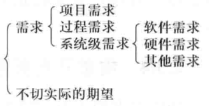

- 项目需求：成本、时间等
- 过程需求：分工合作、方法、工具等
- 系统级需求
  - 软件需求
    - **功能需求**：和系统主要工作相关的需求，即在不考虑物理约束的情况下，用户希望系统所能够执行的活动，这些活动可以帮助用户完成任务。功能需求主要表现为系统和环境之间的行为交互。

    - **性能需求**：系统整体或系统组成部分应该拥有的性能特征，例如CPU使用率、内存使用率等。
      - 速度：系统完成任务的时间

      - 容量：系统所能存储的数据量

      - 吞吐量：系统在连续的时间内完成的事务数量

      - 负载：系统可以承载的并发工作量

      - 实时性：严格的实时要求。

    - **质量属性**：系统完成工作的质量，即系统需要在一个“好的程度”上实现功能需求，例如可靠性程度、可维护性程度等。
      - 可靠性：在规格时间间隔内和规定条件下，系统或部件执行所要求能力的能力

      - 可用性：软件系统在投入使用时可操作和可访问的程度或能实现其指定系统功能的概率

      - 安全性：软件阻止对其程序和数据进行未授权访问的能力，未授权的访问可能是有意，也可能是无意的。

      - 可维护性：软件系统或部件能修改以排除故障、改进性能或其他属性或适应变更了的环境的容易程度

      - 可移植性（Portability）：系统或部件能从一种硬件或软件环境转换至另外一种环境的特性。

      - 易用性（Usability）：与用户使用软件所花费的努力及其对使用的评价相关的特性。

    - **对外接口**：系统和环境中其他系统之间需要建立的接口，包括硬件接口、软件接口、数据库接口等等。
    - **约束**：进行系统构造时需要遵守的约束，例如编程语言、硬件设施等

    - **数据需求**：功能需求的补充。数据需求是需要在数据库、文件或者其他介质中存储的数据描述
  - 硬件需求
  - 其他需求
- 不切实际的期望

## 3. 商业模式类型

### 3.1 多边平台商业模式

企业或组织实现价值主张的方式从自己负责（封闭）走向自己主导促进多群体互动（开放，互联成本大幅度降低）

概念：

- 多边平台将两个或更多独立但相互依存的客户群体进行连接
  - 平台对于其中某一客户群体的价值：其它群体的存在
  - 平台通过促进不同群体之间的互动而创造价值
  - 一个多边平台的价值提升在于它所吸引的用户数量的增加

- 单个用户群体的价值本质上取决于平台中另一群体的用户数量
  弄清楚哪一“边”能够更好的吸引其它“边”，从而提供免费服务甚至补贴

谷歌的商业模式：平台推广

- 建立并维护搜索引擎的基础设施
- 将平台推广给新用户、新内容提供商、新广告商

Wii vs. PS/Xbox：平台收益流补贴

总结：

- 价值主张一般体现在如下三方面：吸引用户、群体配对、利用平台交易渠道降低交易成本
- 客户群体相互依存，无法独立
- **核心资源**是平台，成本主要来自于平台的维护和开发
  三项**关键活动**：平台管理、服务实现、平台升级
- 多个收益流，补贴正确的客户群是定价决策的关键

### 3.2 免费的商业模式

概念：

- 至少有一个关键的客户群体可以持续免费地享受服务
  - 不付费客户所得到的财务支持来自于另一个客户群体
  - 对价格为0的商品的需求要数倍于定价为1分钱或更高的商品：数字产品与服务的复制传播成本接近于0（海量用户下边界成本也趋向于0）
- 三种可行的免费商业模式
- 共同点：至少一个群体将得到免费的商品
- 广告模式：基于多边平台的免费商品
- 免费增值：免费的基本服务，可选的增值服务
- 诱饵&陷阱：以免费或很便宜的初始价格吸引客户，并引导其重复购买

#### 广告

**关键业务**：好的产品和服务以及高流量会吸引广告商，进而补贴产品和服务

- 要考虑广告费能否支撑起产品服务质量
- 吞噬广告费的产品太多，流量红利已见底

成本：平台的开发和维护，以及可能的获客与维系成本

#### 免费增值

收入形式：大量用户从免费服务获益，少量用户为增值服务付费

开源：与众不同的免费增值

- 代码免费完整开放（多种许可证）
- 年费换取最新源码使用权、无限制服务支持、产品法律上拥有者联系的保证

保险行业模式：倒转的免费增值

- 大部分客户定期支付小额保费以补贴一小部分产生实际索赔的客户

总结：

- **核心资源**：平台是最重要的资产，产生三部分成本：可观的固定成本、免费账户的低边际成本服务、增值账户成本

- **关键业务**：客户关系自动且低成本，免费用户向增值用户转化率是重要指标
- 收入来源三个重要公式
  - 收入 = 用户数量\*增值用户比重\*增值服务价格\*增长率\*顾客流失率
  - 服务成本 = 免费用户数\*免费服务成本+增值用户数\*增值服务成本
  - 运营利润 = 收入 - 服务成本 - 固定成本 - 获客成本
- 平台发展新趋势：高水平、差异化的产品与服务（为免费增值提供空间）

#### 诱饵&陷阱

核心业务：产品与后续产品之间要有紧密连接，从而使得极小收益的初始购买为后续高收益产品或服务的重复购买创造可能

关注后续产品交付，需要强大品牌（专利护城河 + 资源）支撑

重要成本结构：初始产品补贴与后续产品的成本

### 3.3 长尾商业模式

长尾商业模式价值主张的特点：提供宽范围非热销品，与热销品共存；也可能基于用户创造，并由平台支持

需要同时找到小众客户和小众产品提供者

依赖于多边平台（互联网）去连接小众客户和产品

收入来源五花八门 - 广告、产品销售、订阅费

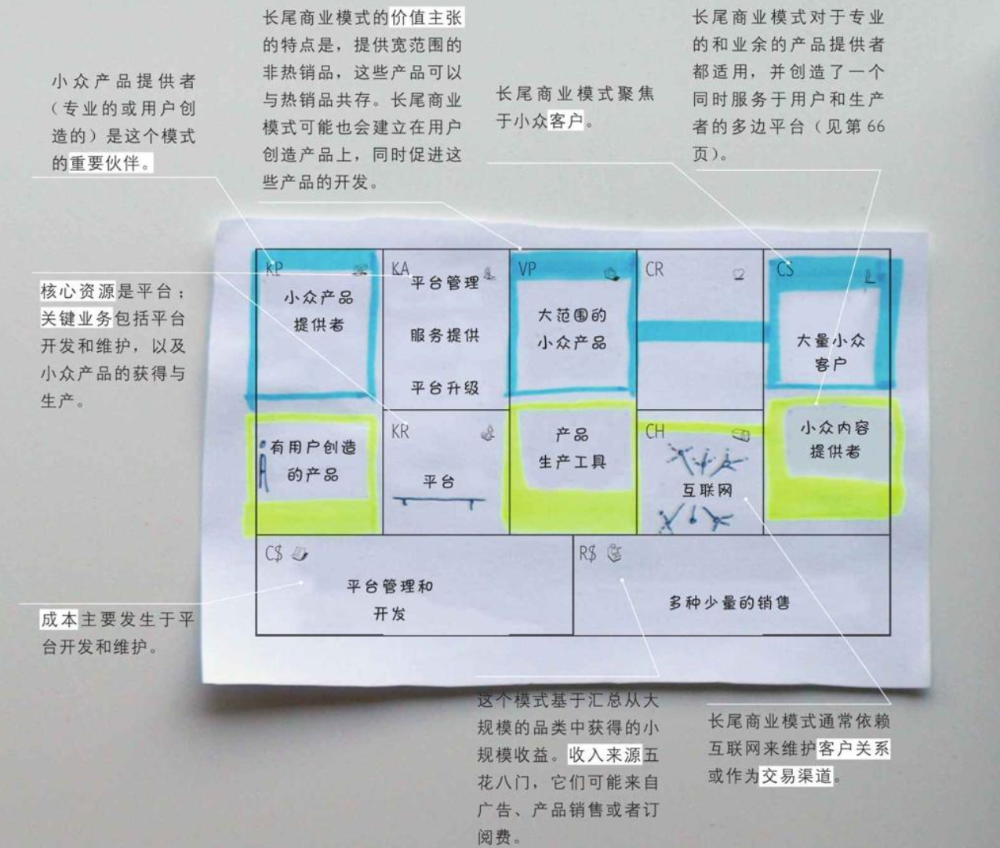

## 4. 商业模式设计（6 选 2）

作为一名设计师

- 必须执着地探究所有可能性，直到创造出崭新的设计，开拓从未被人开发的领域，最终
- 现想要的功能（所有创新类工作的本质）
- 设计师的工作：挑战思维边界、创造新选择、最终为用户创造价值

设计师需要：专业的辅助工具与方法，以及工作态度（thinking，思维）

- 商务人士每日工作：设计组织架构、战略、商业模式、流程和项目
- 必须考虑复杂因素：竞争对手、技术、法律环境，将设计工具与商业技巧（领域知识）相结合
- 需要想象“不存在的东西”，却往往要在非常严苛的条件之下进行

本书介绍的六种商业模式设计方法：客户洞察（customer insights）、构思（ideation）、视觉化思考（visual thinking）、模型构建（prototyping）、讲故事（storytelling）和场景（scenarios）

设计的三个相互重叠的空间：灵感、构思、实施

### 4.1 客户洞察

客户视角是商业模式的指导性原则，客户的观点决定了我们选择怎样的价值主张、渠道、客户关系和收益来源

- 透彻的观察，发现情感的源泉，发现内在的内容、意义与本质
- 事实上，企业在市场上重金投入的产品、服务和商业模式往往会忽略客户的观点
- **成功的创新需要深入理解客户的环境、日常工作、担忧和渴望**

客户洞察的难点

- 透彻理解客户（ “问题背后的问题” ）；需要**人类学、社会学理论**（笼统的人），以及与**实地调研**（具体的人）结合；
- 清楚了解企业当前关注哪些客户（的需要），忽略哪些客户（的需要）- **需要有所取舍**

辅助工具：移情图（Empathy Map）

- 构建用户画像的易用工具（“素描”），可导出价值主张、渠道、客户关系、收入来源（**画布价值端**）
- 使用方式：罗列所有客户群体，挑选三个最有希望的，选择一个作为分析对象
  分析前准备：为客户群体命名，标记含收入、婚姻状况等在内的人口统计学特征

#### 移情图

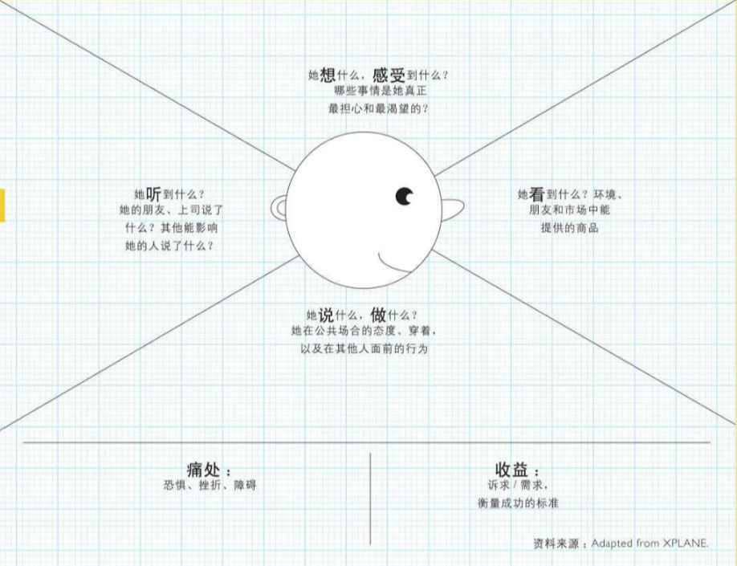

- 看：描述该客户在她所处的环境中所看到的东西
- 听：描述环境如何影响到这个客户
- 想&感受：尝试勾勒你的客户思维的过程
- 说&做：想象客户可能的言辞，或公共场合的行为
- 痛点：已遭受的挫折、正遇到的阻碍、怕承担的风险
- 收益：预期成就、成功衡量标准、实现目标所采用的策略

#### 变需要为需求（人为核心）

洞察力是设计思维的关键来源之一（重视人的行为）

从设计到设计思维的演化，本质上是由创造产品演化到分析人与产品的关系，进而演化到人与人的关系

设计思维的任务：观察结果转为洞察，洞察再转为改善人们生活的产品和服务

- 观察：关注人们没有去做和说的，重视边缘地带的表现
- 观察向洞察的转化需要：专业领域知识（笼统的人），深入到具体场景中去观察人的具体行为（具体的人）

#### 客户洞察的核心：换位思考

换位思考：一种心理习惯，促使我们体会到每个人的感受，而不是将他们当做小白鼠或实验偏差

- 第一层：功能 - 与观察的用户互换身份
- 第二层：认知 – 体会用户的感受与“潜在需求”
- 第三层：情感 – 寻找能触动和推动目标人群的想法
- 拓展针对个人的换位思考（到群体）

帮助人们发掘未能意识到的潜在需求，是设计思考者面临的挑战

- 将用户引入设计
- 在解决用户痛点之外，进一步引导用户实现（额外的）自我价值

### 4.2 构思

一个能够产生大量商业模式创意，并成功识别出其中最佳创意的流程被称作**构思**

- 大多数行业只有一种主流商业模式的现状已经改变，同一个市场中会有多种商业模式进行竞争，行业之间的界限也正变得模糊甚至消失
- 创造新商业模式时需要忽略现状并停止对操作性问题的担忧
- 商业模式创新不是抄袭经典或者对标“友商”，而是创造新机制来满足那些未被满足的、新的或者隐藏在背后的客户需求

构思的两个步骤：生成大量创意->对创意进行整合并挑选。生成阶段要重视数量；可行的创意可以是颠覆性的，也可以是领域的扩展

提出新创意的两个出发点：从画布中寻找创新的焦点；不断提出“如果…会怎样”的问题

#### 商业模式创新的焦点

**资源驱动**：创新来源于组织现有的基础设施或合作伙伴资源
~云计算服务、高传输低时延的5g网络，新能源与特斯拉的野心~

**供给驱动**：创造全新的价值主张，并影响到其它模块
~水泥输送从48小时减为4小时~
~云端的全托管机器学习与自动调优、云游戏~

**客户驱动**：基于客户需求、可获得性或便利性的提升，并影响其他模块
~23andMe的个人DNA测试服务（从医疗与研究领域转来）~
~付费自习室：价值主张-（成年人）沉浸式学习空间；收入来源：5-20元/小时租赁~

**财务驱动**：由新收益来源、定价机制或者被缩减的成本驱动的创新
~施乐复印机从卖设备转向复印机出租（月费95美元，含2000份复印，超出5美分每张）~
~免费经济：360免费杀毒，IBM服务器从软件+硬件转型为开源+咨询+硬件~

**多点驱动**：多焦点驱动的创新，并对其它模块产生深远影响
~“卖设备”转为“卖服务”：财务、供给、客户、资源~
~B站：与共青团及官媒的合作、内容从二次元到多圈融合、从内容转向社交（陪伴）、高粘性用户的游戏运营与内容驱动直播~

#### 利用“如果…会怎样”问题来挑战传统思维

用此类问题打破在设计过程中遇到的现有商业模式的束缚，并使更多新奇的、难以执行的主张闯入我们的思维

基本类型：“从0到1”、“调整/转向”

此类问题只是思考的起点，需要继续构建基于假设的商业模式
如果某些问题找不到答案，则有可能是思维太过于激进，或未能找到一个合适的商业模式来承载

#### 构思的流程与团队建设

1、团队组建：除了“创意天才”，更需要多样化创新团队
成员多样化：业务单元/领域不同、年龄/资历水平不同、文化背景不同、经验互补（例：美团成长期重要人物 – 原阿里“中供铁军”骨干干嘉伟）
要引导积极倾听，并考虑在关键会议上引入一个中立的引导员或主持人

2、钻研：创新所需要的知识：总体研究、客户与潜在客户、新技术调研、现有商业模式评估等

3、开拓：从九大模块任意一点出发作为创新起点；数量是关键；重在创意，避免过早评论价值

4、甄选标准：在业务背景下包含：预期实施时间、潜在收入、可能的客户阻力、对竞争优势的影响

5、构建原型（模型）：确立标准后从创意中整理一个最优短名单，由此构建3-5个创新的商业模式，再利用画布进行勾勒和讨论

#### 头脑风暴（构思的重要手段）的规则

保持聚焦：精确表达当前问题、始终与客户需求有关、不要跑题太远、将讨论拉回到开始问题

执行规则：坚决执行开始时的规则：“不过早下结论”、“每次一人讲“、”追求数量”、“可视化”、“疯狂创意”

视觉化思考：将创意写或者画在每个人都能看到的地方：便利贴+黑板/墙

准备：为一次头脑风暴所准备的钻研：技术研讨、实地考察、客户讨论等

#### 明晰思维过程

**构思的三个空间**
相互重叠，灵感：从各个可能的源头收集；构思：将灵感转为想法；实施：把最佳想法发展成考虑全面的具体实施计划

**项目情绪图与乐观精神**
希望 – （恐慌） – 洞见 – 信心
设计思维与设计团队需要乐观精神，乐观需要信心，信心需要信任

**发散思维与汇聚思维**
发散创造选项，汇聚做出选择
集体思维倾向于汇聚，并得出唯一的结果；发散思维是创新的途径而不是障碍；汇聚中淘汰有希望的想法是痛苦的

**分析与综合**
分析是对复杂问题的分解，综合可视作从大量数据中总结出有意义模式的过程，本质是一种创造
若“原始资料”能被纳入前后一致、令人鼓舞的叙事中，则能引发更高层次的整合

**头脑风暴法**
一种需要训练的、有条理的方法，是创造想法的最好选择
重要规则：暂缓评论、异想天开、不要跑题、借“题” 发挥

### 4.3 视觉化思考

#### 视觉化思考的价值

商业模式的讨论需要视觉化思考：抽象的东西具体化、复杂的概念简单化

- 商业模式是一个由许多模块以及模块之间的复杂关系组成的复杂概念，其内部元素相互影响，但只有作为一个整体系统时才有意义
- 视觉化能够一目了然的刻画商业模式的主旨，并具象化其中的隐含假设
- 视觉化能够使商业模式变的明确，为团队讨论提供一些概念性的锚点，使讨论从抽象思维落实到具体、形象的东西
- 视觉化既能找出已有模式中的逻辑缺陷，又能在设计全新模式时更容易地添加、删除和移动相关的图片化概念

视觉化思考使用的两项技术与四个流程

- 如何使用便利贴+如何将草图与商业模式画布结合
- 四个流程：理解、对话、探索、沟通

#### 便利贴+绘画

便利贴的重要性：随意的添加、删除、移动（在画布上的位置）

三个指导方针：**粗的马克笔+只写一项元素+只用少量文字抓住关键点**

绘画的强大表现力：人对图像的反应要比文字强烈的多

#### 作用

**理解商业模式的本质**

- 视觉化的语言：画布是一张概念图，其功能类似于具有语法规则的视觉化语言，提供了视觉和文字的指引，帮助画出模式中所需的所有信息
- 抓住全貌：画布的草图能够为观众提供足够的信息理解全貌，而不被过多的细节影响理解
- 看到关键：一定要理解元素/模块之间的关联关系

**提升对话效率**

- 共同的参照点：**将头脑中不言而喻的主观假设具象化**，并将大量内容固化成为可回溯的参照点（人类的短时记忆只能保留有限数量的想法）
- 统一的语言：利用图形和画布帮助不同参与者聚焦，特别是来自不同领域的人
- 一致的理解：帮助不同部门的人**将其深入理解的部分表达出来**，再一起形成整体的洞察与一致的理解

**探索创意**

- 激发创意：模糊的想法-随着灵感发挥-有机地整合成一幅图画
- 演习：视觉化的模型帮助思考部分元素的改变引发的系统性冲击
- 隐藏要素：添加、填充充分的细节 – 不要说空话套话

**提升沟通**

- 统一公司内部的理解：用图画在组织内形成共识，朝一个战略方向前进
- 内部推销：好的图画使组织的现状、需要做的事情、怎么做、未来会怎样等方面变得易于沟通，从而赢得组织内部的理解和支撑
- 外部推销：提升向投资人或潜在合作伙伴推销成功的概率

### 4.4 模型构建

#### **模型构建**的价值

与视觉化思考一样，模型构建可以使抽象的概念具体化，帮助探索新的创意
在产品、架构和交互设计上得到广泛应用，但在商业管理领域不太常用
这里的“模型”：用于讨论、探究或概念验证的工具，目标是探索未来潜在的商业模式（不等于软工领域的模型或原型），可以是草图、画布或财务报表

模型构建有助于实际商业模式的探索
建模-（疑问点明确化、视觉化）-添加、删除或修改元素-观察结果
在不同规模（抽象层面）的模型上进行互动
有助于获得突破性的商业模式，同时能够有效控制细节

#### 设计态度与控制规模

设计态度：专注探索，全面考虑，快速放弃，选出值得优化的想法，接受不确定性

控制规模：通过绘制很多（粗略的和细致的）模型来代表各种战略选择，再通过对每个模型添加和移除元素的方式来探索新想法

- **随手素描**：勾勒和推销一个粗略的主意
  勾勒想法，含价值主张和主要收益来源
- **精心描绘的画布**：探索实现该创意所需的因素
  完整画布，商业逻辑思考，市场潜力预估、理解模块之间联系、“事实查证” – 真正用画布细化和探索，而不是“完成”后填充画布
- **商业案例**：检查该创意的可存活度
  全面画布，关键输入、核算成本与收入、估算利润潜力、模拟财务场景
- **实地验证**：调查客户的可接受度和可行性
  准备合情合理的商业案例，站在客户角度进行实地验证，验证价值主张、渠道、定价机制等实际市场中的元素

#### 用手来思考

- 必须给创造性团队时间、空间和预算去犯错：在模型构建（原型）阶段尽可能地去试错

- 模型，不求精细，胜在快速
  早期的模型应该是快速的、粗糙的、便宜的（苹果鼠标：走珠+黄油盘）
  适可而止：模型的目的是赋予想法具体的外形，了解该想法的长处和弱点，从而为更详细、更精密的下一代模型寻找方向（最终转向具体设计）

- 现场制作模型
  用户模拟空间（喜达屋酒店雅乐轩品牌下的虚拟酒店）
  灰度上线、A/B与内测；依赖复杂社会互动的服务更需要使用现场模型

### 4.5 讲故事

#### **讲故事**的价值和目的

故事是一个理想的热身工具，为深度讨论商业模式与其内在逻辑做好准备
将故事与画布结合，利用叙事性克服听众对不熟悉模式的抵触，放下对陌生事物的怀疑
叙事性 – 时间的演化（时间地点人物，起因经过结果）

为什么要讲故事
介绍新想法：尝试融入组织战略
向投资人推销：争取外部资源（是什么，为谁服务，如何获得收益）
吸引员工（成员）：抓住组员的注意力和好奇心，为下一步探讨准备
让未来触手可及（具象化）：激发创意、辩证变革

#### 故事的不同视角

**公司视角**

以员工为视角：
1、观察到的新商业模式所解决的客户问题
2、新商业模式如何比旧模式更好的利用资源、业务和伙伴关系（降本增效、开源节流）
3、员工承载了组织内部工作与商业模式，以及转向新模式的原因

**客户视角**

以客户为视角：
1、客户面临的挑战与必须完成的工作，以及组织如何为其创造价值
2、描述她得到的东西、这些东西如何融入她的生活、以及她愿意为哪些东西付费
3、可以添加一些戏剧性和情感因素，描述你的组织如何让她的生活更简单，并尝试加入组织如何提供帮助，并需要哪些资源和活动
4、故事需要真实可信，避免油腔滑调或居高临下的口吻

#### 讲故事的方法

|            | 图片和旁白                                       | 视频                                                         | 角色扮演                                   | 文字和图片                                         | 连环图画                                         |
| ---------- | ------------------------------------------------ | ------------------------------------------------------------ | ------------------------------------------ | -------------------------------------------------- | ------------------------------------------------ |
| 描述       | 用一张或很多张图片来讲述一个主角的故事和他的环境 | 用视频来讲述一个主角的故事和他的环境可以拉近现实与幻想之间的距离 | 让人们扮演故事中的主角，构建逼真形象的场景 | 用文字和一到数张图片来讲述一个主角的故事及他的环境 | 用一系列的卡通图片来栩栩如生地讲述一个主角的故事 |
| 何时用     | 小组讨论或会场讲演                               | 向一大群听众广播或者内部做有重要财务意义的决策               | 相互陈述新开发的商业模式创意的研讨会       | 向一大群听众汇报或广播                             | 向一大群听众汇报或广播                           |
| 时间和成本 | 低                                               | 中/高                                                        | 低                                         | 低                                                 | 低/中                                            |

#### 讲述视觉化的故事

解释商业模式的一种有力的方式：利用画布草图逐一介绍一个完整的视觉化故事

如何讲述

- 绘制商业模式
  用简单的文字填充各个商业模式模块
  一个模块只用一张便利贴
- 用图形描绘每个商业模式元素
  每次取下一张便利贴，再用图形去取代文字想表达的内容
  图形保持简单
- 设计故事主线
  决定讲故事的时候先贴哪张便利贴
  可以尝试不同的主线与起点，只要能支撑故事
- 讲述故事：根据便利贴的顺序与贴图的内容逐一讲述你的商业模式

### 4.6 场景

将模型构建中明确方向具体化，从而给出有见地的设计

两种场景

- 不同的客户结构：结合客户洞察描绘出独特、具体的图景
  由场景决定选择哪款产品而放弃其它产品（价值主张的排他性）
- 未来可能的竞争环境：想象未来可能的具体细节，品味特定条件下商业模式如何演进

#### 为一个故事设计并补充场景

- 场景说明：讲故事+场景
  虚构人物+统计学要素+日常生活+可信场景
  促使人成为想法的中心，防止迷失在机械的、程序的或美学的细节中

- 角色扮演：发掘生活内在脚本
- 构造场景为顾客打造体验，制作用户体验蓝图
  体验蓝图：人与人互动的细节+情绪因素，并找出最有意义的时间点
  优质的开始体验、巅峰体验、结束体验

指导方针：1. 能够促使消费者积极参与；2. 可信、真实、吸引人的体验往往来自于企业自身的体验型文化；3. 场景中与客户的接触点必须做到深思且精确（重点设计讲故事中的关键场景）

#### 场景的分发

场景的分发（与运营）
引导用户体验一到多个独特场景下的产品功能
逐步引导用户进一步体验产品的其它场景

#### 信息技术如何改变世界 – 构造场景

人类社会的整体视角 – 人人互联的“小小世界”

- “六度分离”现象的背后 – 任何一种人人互动都会形成网络/群体，群体的局部行为会导致全局性的结果
- 移动互联网 – 低成本互联下的“更小世界”
- 单个网民视角 – 通过场景连接到不同群体（所在的现实/虚拟空间）

场景的连接

- 场景原定义：影视用语，指特定时间、空间内发生的行动，或指由人物关系构成的具体画面，是通过人物行动来表现剧情的一系列特定过程
- 基于场景的（构建产品）思维方式：将互联网视为连接不同个体制造场景（空间）的工具，以及完成连接的高效率方法 – 代表：朋友圈/小红书
- 从而达成：形成（产品）体验、促成（客户）消费、创造个体生存意义

互联网场景定义 – 与互联网行为相关的，通过支付完成闭环的应用形态，包含以下两类典型场景（可兼具）：

- 超级入口：触发用户沉浸式体验或长时间停留的应用形态（游戏、社交、购物等）
- 支付场景：应用移动支付完成交易的场景

## 5. 商业模式评估（3 选 1）

### 5.1 商业模式环境分析

商业模式的演进（创新）注定是复杂的、不确定的，甚至颠覆性的

市场影响力、行业影响力、关键趋势和宏观经济影响这四个方面的分析为商业模式创新提供了设计空间

- 使用模型构建来展开设计（竞品）
- 通过场景进行对未来的探索（聚焦）

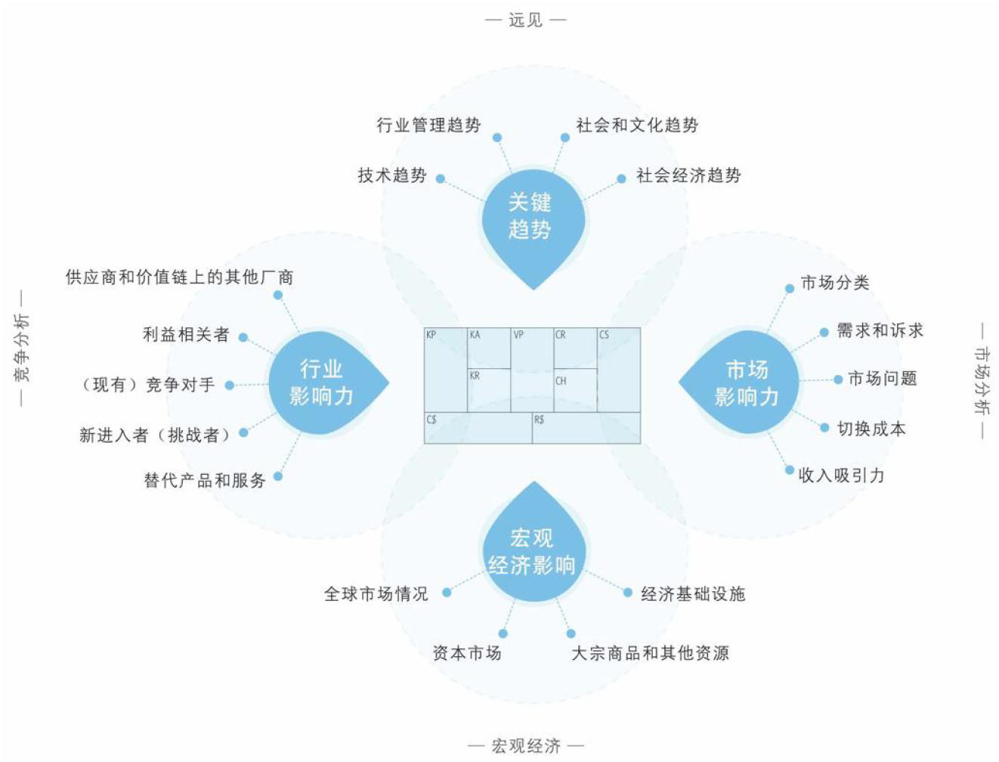

#### 市场影响力

**市场问题**

- 从客户和供给的角度识别出驱动和改变你的市场的关键问题
- 影响客户环境的关键问题有哪些？哪些改变正在发生？市场将走向何处？

**市场分类**

- 识别主要的市场群体，描述他们的兴趣点，尝试发现新的群体
- 哪些是最重要的客户群体？哪个群体的增长潜力最大？哪些群体在缩小？哪些边缘群体值得留意？

**需求和诉求**

- 列举市场需求并分析这些需求被满足的程度
- 客户需要什么？没有被满足的客户需求里哪个最值得关注？客户真正想要搞定什么？哪些需求在增加？哪些在减少？

**切换成本**

- 客户转投竞争对手（比如你自己），需要改变哪些方面
- 哪些东西将客户捆绑在一家供应商和它的服务上？哪些切换成本阻止客户转投竞争对手？客户容易找到并采购类似的服务吗？品牌有多重要？

**收入影响力**

- 识别与收入吸引力和定价能力相关的因素
- 客户真正愿意花钱买的是什么？利润中最大的一块从哪里获得？客户能够轻易地找到并购买更便宜的产品和服务吗？

#### 关键趋势

**技术趋势**

- 威胁和推动发展当前商业模式的技术趋势
- 你的市场内外的主要技术趋势有哪些？哪些技术代表了重要的机会或者颠覆性的威胁？哪些新兴技术是边缘客户正在逐步采用的？

**行业管理趋势**

- 影响（你的）商业模式的管理规定和管理趋势
- 哪些管理趋势会影响你的市场？哪些规则会影响你的商业模式？哪些管理规定和税费会影响客户需求？

**社会和文化趋势**

- 可能影响（你的）商业模式的社会趋势
- 描述关键社会趋势。文化或社会价值观上的哪些变化会影响你的商业模式？哪些趋势会影响购买者的行为？

**社会经济趋势**

- 总结和你的商业模式有关的主要社会经济趋势
- 关键的人口统计学趋势有哪些？你的市场中收入和财富的分布有哪些特征？描述你所处市场的消费特征。城镇人口相对于农村人口的比例如何？

#### 行业影响力

**主流竞争对手**

- 识别它们以及它们的相对优势
- 谁是我们的竞争对手？哪些是我们这个领域的主流玩家？他们的竞争优势或劣势是什么？描述他们的主要产品和服务。他们聚焦哪些客户群体？他们的成本结构如何？他们对我们的客户群体、收益来源和利润有多大影响？

**挑战者**

- 新出现的玩家以及它们商业模式的不同
- 谁是你所处市场的新进入者？他们之间有什么不同？他们有什么竞争优势或劣势？他们必须克服哪些障碍？他们的价值主张是什么？他们聚焦哪些客户群体？他们的成本结构是什么样的？他们对我们的客户群体、收益来源和利润有多大程度的影响？

**替代产品和服务**

- （包括其它市场和行业在内的）替代产品与服务
- 哪些产品和服务能够替代我们的产品和服务？它们的成本与我们相差多少？客户要切换到这些替代品有多容易？这些替代产品起源于何种商业模式传统？

**供应商与价值链上的其他厂商**

- 当前价值链上的关键玩家与新兴玩家
- 谁是你的行业价值链中的关键玩家？你的商业模式在多大程度上依赖其他这些玩家？有边缘玩家在涌现吗？哪个的利润最高？

**利益相关者**

- 哪些人会影响你的组织和商业模式

- 哪些利益相关者会影响你的商业模式？股东的影响力如何？员工呢？政府呢？游说者昵？

#### 宏观经济影响

**全球市场情况**

- 从宏观经济角度总结当前整体情况
- 经济处于爆发期吗？描述总体市场情绪，GDP增长率是多少？失业率有多高？

**资本市场**

- 与你的资本需求相关的当前资本市场情况
- 资本市场处于什么状态？在你所处的市场中，获得投资有多容易？现在就能获得种子资本、创业资本、众筹、市场资本或者贷款吗？获取这些投资的成本有多高？

**大宗商品和其他资源**

- 关注你的商业模式所需的资源价格与趋势
- 描述你的业务必备的大宗商品和其他资源的当前市场状态。执行你的商业模式所需的资源有多么容易获取？成本如何？价格走向如何？

**经济基础设施**

- 你的业务市场的经济基础设施
- 你所处市场的（公共）基础设施有多优良？你如何评价交通、贸易、学校质量，以及连接供应商和客户的便利度？个人和企业的税费有多高？对商业组织的公共服务有多好？你如何评价这里的生活质量？

### 5.2 总体评估

整体（完整画布）评估：以 Amazon.com 为例

05年的优势与劣势
成本来自于最出色的几项业务，即配送与技术（7.45亿美元，占比46.3%）+内容（4.51亿美元，占比28.1%）
销售产品利润率低，含书籍、音乐CD与DVD
05年亚马逊销售额85亿美元，利润率4.2%；谷歌61亿，23.9%；eBay46亿，23.7%
阿里巴巴03年每天销售100万，04年每天盈利100万，05年纳税25480万元
06年拓展的机会
亚马逊配送：仓库+分拣+投递+网站
亚马逊云
阿里的整体评估与后续发展：双十一很成功 - 后端业务的弹性负载很重要 - 阿里云 – 从提供基础服务支持到提供业务支持 – 低代码（钉钉）？

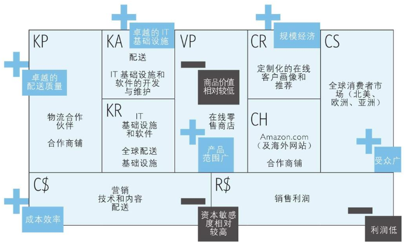

### 5.3 SWOT

#### 评估优势 & 劣势

传统 SWOT 分析与商业模式画布结合

- 画布的存在帮助聚焦 SWOT 分析，避免模糊，实现聚焦
- 按照价值主张、成本/收入、基础设施（KR+KA+KP）、客户界面（CS+CH+CR）四类展开评估

SWOT 问了四个简单的大问题。前两个——你的组织的优势和劣势是什么？内部评估你的组织。后两个——你的组织的机会有哪些，面临的潜在威胁又有哪些？在所处的环境下评估你的组织的位置。在这四个问题中，两个识别有利的领域（优势和机会），另两个识别有害的领域。

**价值主张（价值观 vs. 性价比）**

网络效应：各项价值主张之间相互联系，相互促进

- 产品与服务的强耦合：
  以服务为主的，服务中使用的产品和环境能否满足服务的需要
  以产品为主的，服务能否有效支持产品传递和售后
- 价值观如何构建：客户洞察

**成本/收入**

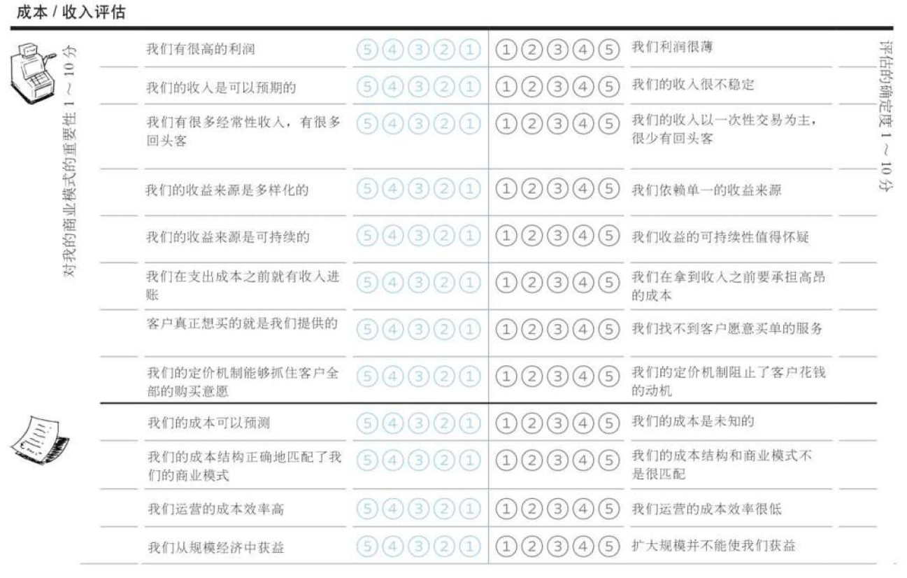

是否利润高成本低、收入/成本可预期、收益是否稳定&多样化&可持续、收入账期是否合理、客户需要与定价机制是否合理、运营效率&能否扩大规模后受益

**客户界面**

客户细分：客户忠诚度、客户分类（洞察）、持续获客与获客成本
渠道通路：效率、效果、连接能力、易于接触、是否整合、规模经济、匹配
客户关系：品牌、匹配、切换成本 - 强渠道或服务难以替代

客户连接、分类、拉新的质量；渠道的效率、效果、曝光度&匹配度、是否整合且产生规模经济；产品品牌、是否良好匹配客户、切换成本是否较高

**基础设施**

核心资源的排他性、可预测性、时效性；关键业务的独特性与完成质量；自身是否聚焦且能与重要合作伙伴展开良好合作

#### 评估威胁

| 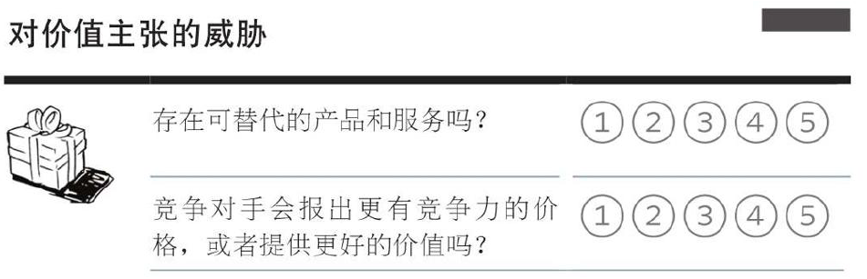 | 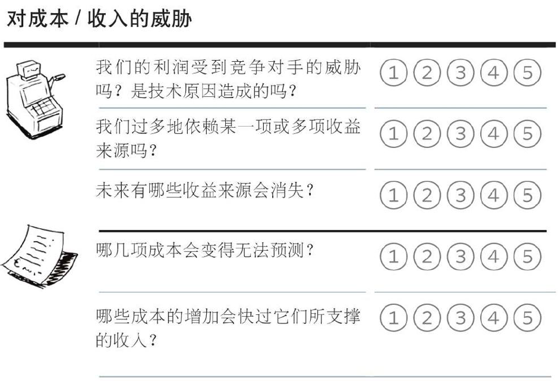 |
| ------------------------------------------------------------ | ------------------------------------------------------------ |
| 对价值主张的威胁（可替代性）                                 | 对成本/收入的威胁（利润的威胁、是否单一、缩水、无法预测、无法支撑） |

| 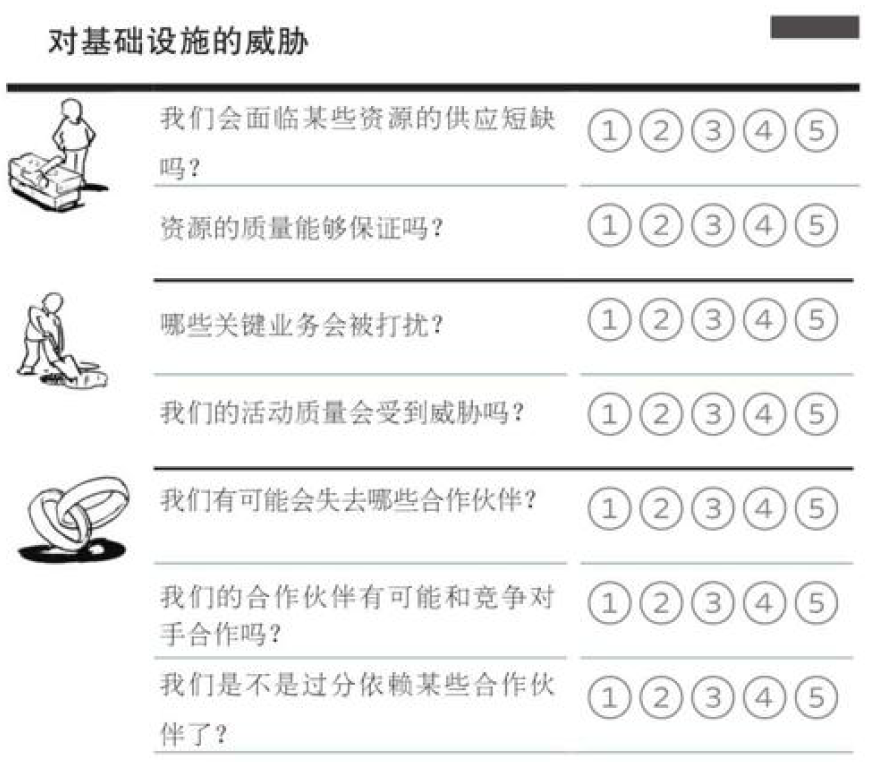 | 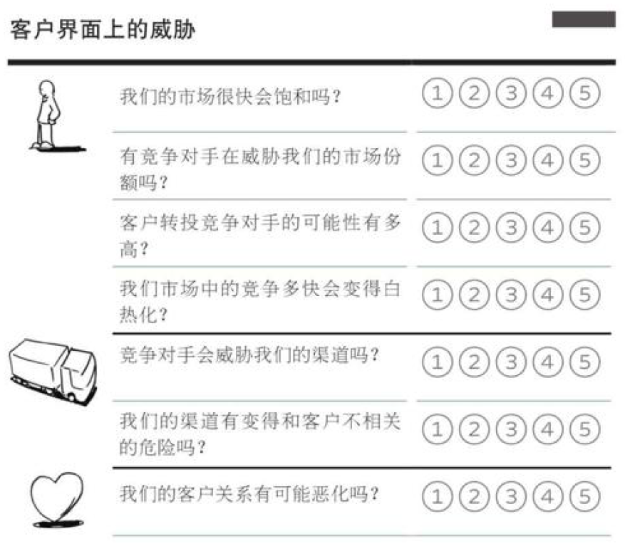 |
| ------------------------------------------------------------ | ------------------------------------------------------------ |
| 对基础设施的威胁（供应不足、干扰、合作关系波动）             | 客户界面上的威胁（市场竞争、渠道威胁、客户关系恶化）         |

#### 评估机会

|  | 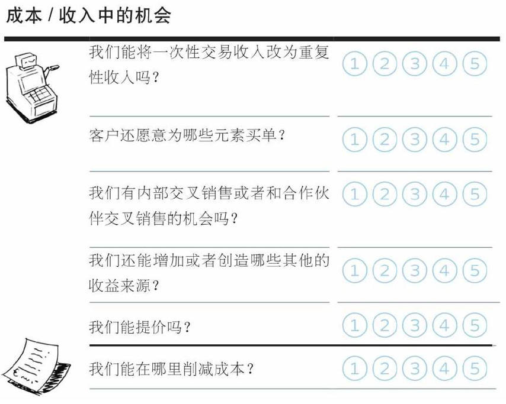 |
| :----------------------------------------------------------- | :----------------------------------------------------------- |

**价值主张中的机会（整合、服务化与拓展）**

- VP：产品与服务能否整合，产品能否服务化？
- 价值主张的补充和外延？
- 满足客户的额外需求或其它可做的工作？

**成本/收入中的机会（可重复、交叉销售、开源节流）**

- R$：重复性收入代替一次性收入（会员自动续费）、寻找额外买单元素与交叉销售的机会（套餐与B站影视）、新的收益来源（B站会员购、花火平台、线下授权火锅+烧烤）、能否提价（共享单车与瑞幸的涨价）
  - 交叉销售，通过客户关系管理发现现有顾客的多种需求，并通过满足其需求而销售多种相关服务或产品的一种新兴营销方式
- C\$：成本削减（全要素生产率：劳动、资本、原材料、能源等所有生产要素，决定不同经济体增长差异）

| 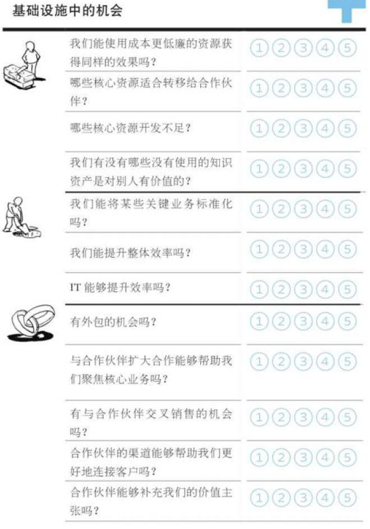 |  |
| ------------------------------------------------------------ | ------------------------------------------------------------ |

**基础设施中的机会（强化核心、减轻负担、转让闲置）**

- KR：核心资源的降本、外包、强化、转让（降本增效、技术壁垒、技术转让，可口可乐灌装厂的自营与外包）
- KA：标准化、IT技术带来的整体效率提升（海尔设计团队的微服务化，实体产业的互联网化，机构组织的扁平化）
- KP：外包与核心业务聚焦、交叉销售与更好的客户连接、价值主张补充（荣耀的剥离与米家化、联名款）

**客户界面的机会（增长的市场、客户细分、渠道优化与去中间商，客户关系加强与取舍）**

- CS：找到增长的市场并从中获利、服务新客户群体或更细致的已有客户分类（不断涌现的社交类产品 – 青藤之恋）
- CH：渠道的效率、效益、整合，补充性的渠道伙伴，去中间商、渠道客户匹配（腾讯与京东，PDD与B站，淘宝直播）
- CR：加强与客户的关系并提升客户跟进的效果（华为19年近20%的盈利增长）、进一步定制化或可自动维护（字节系产品：自动化地信息流定制）、提升切换成本（苹果生态：靠手机 => 靠Mac）、是否抛弃没有利润的客户以及原因（发掘潜力或果断抛弃，字节跳动=>抖音集团与旗下汽水音乐）

### 5.4 蓝海战略

**蓝海战略**：通过根本性的差异化来创造全新的行业，而不是模仿现有商业模式在当前行业中竞争

- 价值创新：不是在传统的绩效指标下超越对手，而是创造新的、未充分竞争的市场空间
- 画布的可视化效果为蓝海战略带来“全局化”的视角
- 通常还与开拓未被开发的客户群体相结合

蓝海战略的“四项行动架构”（增加价值，减少成本）

- 行业中哪些理所当然的要素应被删除
- 哪些要素应被大幅消减至行业标准以下
- 哪些要素应该被大幅调整到行业标准之上
- 哪些行业中从未提供的要素是应该被创造出来的

#### 整合蓝海战略框架和商业模式画布

商业模式右半部关注价值、聚焦客户，左半部分关注成本和基础设施。右侧的改变回对左半部分产生影响

蓝海战略强调在增加价值的同时减少成本，通过删除和消减低价值产品或服务来降低成本，通过提升和创造对成本影响弱的高价值功能或服务来实现

二者的整合使得使用“四项行动架构”分析时能够更好地识别这些行动对商业模式其它模块的影响

#### 通过四项行动架构探究你的画布

|  | 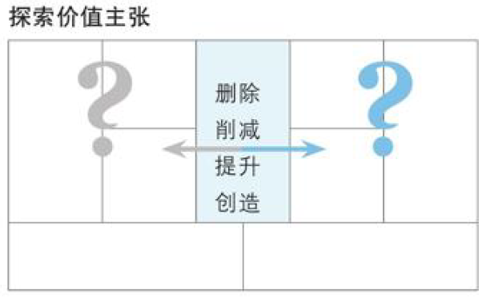 |  |
| ------------------------------------------------------------ | ------------------------------------------------------------ | ------------------------------------------------------------ |
| 哪些活动、资源和合作伙伴关系的成本最高？                     | 哪些低价值的功能或者服务可以被删除或消减？                   | 你可以聚焦哪些新的客户群体，哪些客户群体可以消减或删除？     |
| 如果消减或删除这些成本项，会发生什么？                       | 可以通过新增或加强哪些功能或服务来产生有价值的客户新体验？   | 新的客户群体真正希望你帮他们完成哪些工作？                   |
| 在删减或消除代价高昂的KR、KA或KP后，如何利用低成本的元素来代替它们创造价值 | 价值主张的改变对成本有何影响？                               | 这些客户倾向于何种联络方式，他们期望与你建立何种关系？       |
|                                                              | 价值主张的改变如何改变商业模式客户侧内容？                   | 服务新客户群体对成本有何影响？                               |

#### 辩证地对待蓝海战略：必要性与风险

蓝海战略的必要性：

- 当一个专注于特定领域的公司一家独大时，会为了继续扩大规模而使用非常规手段消灭竞争，利用垄断优势剥削上下游，恶化口碑

- 之后会出现戴维斯双杀：利润率翻倍但股价不涨（没有发展预期），每股收益与市盈率下降
- 在中国会出现优秀人才大规模离开，用户体验下降导致口碑大规模恶化
- 在某个领域取得绝对优势后，无法通过开拓新的赛道满足企业继续成长的压力，导致采用非常规手段争抢和压榨领域内达到上限的利润和资源，最终自我毁灭（内卷化）

（错误的）蓝海战略的风险：空心化、外部潮流与形势变更

- 人类兴趣三年一小变五年一大变（**过于探索客户 – 偏离**）
- （供应链）经济全球化带来的蝴蝶效应（**过于探索成本 – 外包异常**）
- 在一个有限的时间段内，产品与服务过于聚焦某个明星品类（**过于探索客户与价值主张**），过于迷信利润率（**过于探索成本**）
  - 导致“护城河”性质的业务、后续发展的持续动力、或用户信赖的基础丧失