# 需求部分（40 分）

## 1. 需求获取（20 分）

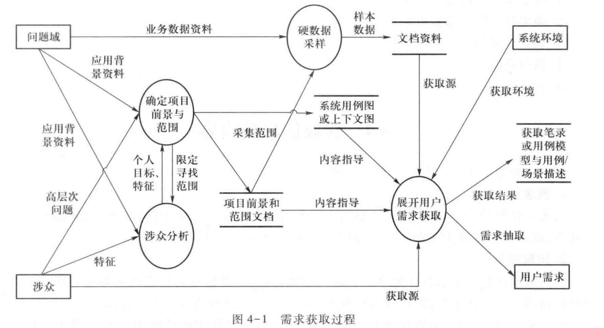

### 1.1 需求获取上半段（10 分）

#### 确定项目的前景和范围 - 目标模型

定义项目前景：所有的涉众都从共同认同的项目前景出发，理解和描述问题域及需求

定义项目范围：范围内的事物和事件是描述的目标

问题分析：收集问题并针对问题达成共识；收集背景资料，判断问题的明确性；分析不明确问题，发现问题背后的问题

发现业务需求

目标：是系统被开发的目的——目标模型的建立与使用

目标规格的基本模式

- 实现（Achieve）：P ⇒ ◊ Q   //如果将来某一时刻Q为真（被满足），则目标实现
- 终止（Cease）： P ⇒ ◊ ¬ Q  //如果将来某一时刻Q为假（被终止），则目标实现
- 保持（Maintain）： P ⇒ □Q //将来任一时刻Q都为真，则目标实现
- 避免（Avoid）： P ⇒ □¬ Q //将来任一时刻Q都为假，则目标实现
- 优化（Optimize）：最大化Maximize (目标功能) 或 最小化Minimize (目标功能)

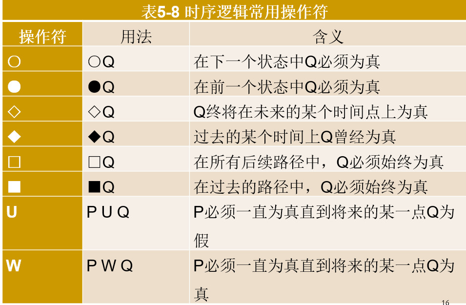

需求工程中一般基于软件分析模型进行建模与分析

软件分析模型：使用计算模型的组元形式与关联关系；描述组元语义时采用了业务模型
基于构建的模型进行业务逻辑推理和验证，抽取需求中的关键与本质，达成用户和开发者的共同理解 

目标类型（组元）与关系举例

- 软目标（云朵）和硬目标（矩形）：能否利用技术手段确认是否满足（是否具体）
- 高层次目标与低层次目标：
  战略性的,全局的, 业务相关 - “增加50% 的传输能力”
  技术性的，局部的，产品设计相关 - “加速器每3秒发出一次命令”
- 目标模型的关系：精化关系（例子中为AND精化）、阻碍关系、支持与冲突关系

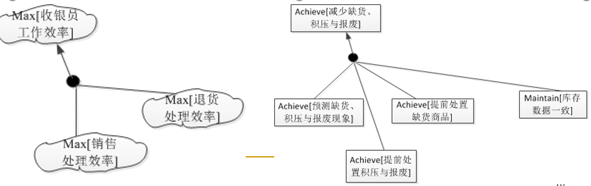

#### 目标模型的关系与分析过程

##### 目标精化

精化（Refinement）关系：一个高层次目标G可以精化为低层次目标{G1,G2,…,Gn}：（**目标精化与实现是目标模型的重要任务之一**）

- 如果一系列子目标{G1,G2,…,Gn}的完成有助于目标G的完成，那么G与{G1,G2,…,Gn}之间就是 AND 精化关系。此时任意两子目标Gi与Gj之间是互补的。如果更进一步，子目标{G1,G2,…,Gn}的完成能够直接保证G的完成{G1,G2,…,Gn}|=G，那么G与{G1,G2,…,Gn}之间就是完备（Complete）AND 精化关系。
- 如果任一子目标Gi都是G的替代方案，那么G与{G1,G2,…,Gn}之间就是OR 精化关系。此时，任意两子目标Gi与Gj之间是互相替代的。

目标的达成需要主体（agent）的参与

越是抽象、粗粒度、范围广的目标，参与的主体越多

当一个被不断精化的目标达到：

- 只包含有待开发的软件系统的部分明确功能 – 任务（要求）
- 主体只有系统环境中的一个对象（例如用户） – 角色
- 同一个被充分精化目标上的角色和任务之间可以建立用例图联系

目标精化的结束条件与约束：

- 子目标展开到单一事务时终止

  - 主体与系统的一次协作活动，或一系列活动，要求全部成功（要么全部失败）

  - 确认这些单一事务能够增加业务价值

- 单一事务可以被进一步展开为场景（任务的要求=>单个任务的描述）
- 注意识别目标隐含的：
  - 假设、依赖与约束：商业规则，特定场景限定；市场与环境假设，业务过程假设…；资源依赖
  - 质量属性

##### 目标阻碍

如果子目标O的达成会使得高层目标G失败O|=¬G，那么O与G的关系就是阻碍关系

阻碍目标也可以继续AND精化、OR精化
阻碍目标最主要的作用：反向的目标更易精化

阻碍关系本身是一种特殊的精化——反向精化

##### 目标支持与冲突

**目标模型的重要任务之二**

多个目标之间关系：Support & Conflict

- Support链接表示一个目标对其他目标的支持作用。支持关系可以被处理为OR精化关系

- Conflict链接表示一个目标的实现对其他目标的实现有阻碍作用

目标实现：将最底层目标分配给主体（人+系统）；设计实现最底层目标的操作（任务：细粒度用例/场景）

#### 涉众分析

涉众：能够影响软件系统的实现，或者会被实现后的软件系统所影响的，关键个人和团体

互联网产品的涉众：人性驱动，但也有围绕业务的利益冲突

- 大众型产品 – 没有明确的“甲方”用户：产品功能能否帮助解决生活中的问题，分析用户与（互联网场景所带来的）社会群体基于产品功能（业务）的互动

- 互联网产品也需要展开基于业务的涉众分析
  - 某产品设计的新功能是否冲击其它功能或本公司其它产品
  - 定期评估商业模式时，是否需要放弃某些客户细分？
  - 平台商业模式中如何补贴多个客户群体的收益流
  - 被产品影响的各监管力量与社会环境（政府、社区）的态度

**涉众评估**：优先考虑涉众的基本特征，尤其是（涉众所完成的）任务特征 

**基于Power-Interest与Power-Attitude模型的风险评估**：基于涉众特征与态度化解涉众风险策略 

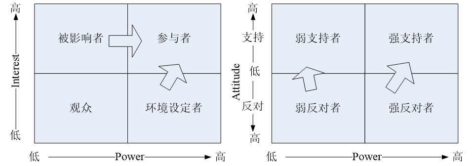

**Stakeholder/Issue关系图**

- 列出系统的所有涉众类别，明确描述他们的兴趣和对系统的期望
- 从涉众们的兴趣和期望中发现背后涉及的共同问题（Issue）
- 建立涉众类别和问题的关联，如果某个涉众类别对一个Issue存在兴趣，那么该涉众类别和这个Issue就存在关联关系
- 对每一个Stakeholder-Issue关系，标明该关系上面所被寄予的期望；

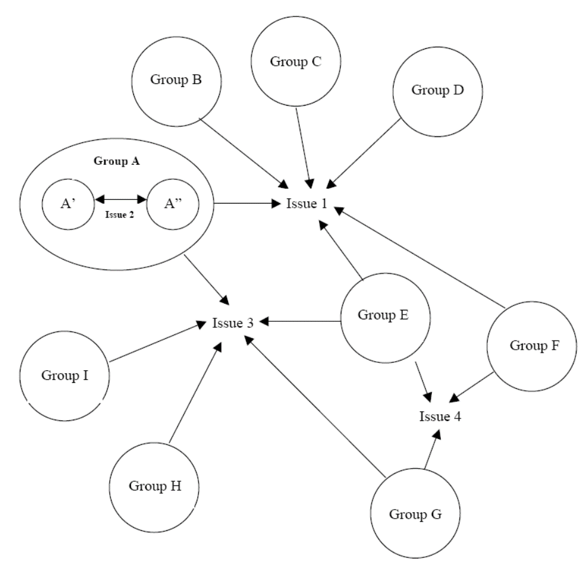

如果某个Stakeholder-Issue关系上所寄予的期望与项目的业务需求无法保持一致，那么它关联的涉众就在该Issue的问题上和项目整体目标存在冲突 （涉众和项目负责人互相调整、折中；重新评估项目的可行性）

如果Stakeholder/Issue关系图中某个Issue所关联的不同关系标识有互相冲突的期望，那么就意味着它所关联的涉众在该Issue上存在需求冲突

- 分析各冲突方成为项目赢家的条件 
- 适当的调整, 化解冲突 
- 分析项目在该Issue上的目标、约束和可选方案，并提供给冲突方进行权衡，促进他们之间协商解决 

### 1.2 需求获取下半段（10分）

#### 面谈、原型、观察

常规方法：**面谈**：与用户创造性地交流，充分发掘用户潜在想法

- 集体面谈：快速方法
- 调查表：用户分散
- 头脑风暴：“发明”需求

不确定性：**原型**：帮助消除用户或需求工程师想法中的不确定性

情景性：**观察**：需求工程师亲自（涉身）观察并发掘情景性需求

#### 面谈问题的设计

问题基本上可以分为两种类型：开放式问题和封闭式问题 

- 开放式问题：被会见者对答复的选择可以是开放和不受限制的，他们可能答复两个词，也可能答复两段话。在希望得到丰富（具有一定深度和广度）信息时，开放式问题比较合适
- 封闭式问题：答案有基本的形式，被会见者的回答是受到限制的 

问题准备：

- 前期：开放式问题为主，决策层与专家为主。遵循 问题→目标→解决方案路线
  问题、目标；目标、任务（流程→任务）
  分析基本的涉众特点：角色、任务、个人目标、频率、优先级
- 后期：封闭式问题为主。抓住主题与线索
  例如，任务分解、流程图、界面示意…
  问题针对性：任务分解关系；流程正确性、异常；界面中的行为、数据项…
  事先准备面谈记录材料

其他重要的问题类型：探究式问题、诱导性问题、双筒问题、元问题 

## 2. 需求分析（10 分）

### 需求分析的根本任务

#### 建立分析模型

- 将复杂的系统分解成为简单的部分以及它们之间的联系，确定本质特征
- 和用户达成对信息内容的共同理解
- 分析的活动主要包括识别、定义和结构化，它的目的是获取某个可以转换为知识的事物的信息

方法：抽象、分解、投影

#### 创建解决方案

- 将一个问题分解成独立的、更简单和易于管理的子问题来帮助寻找解决方案
- 创建解决方案的过程是创造性的
- 帮助开发者建立问题的定义，并确定被定义的事物之间的逻辑关系。这些逻辑关系可以形成信息的推理，进而可以被用来验证解决方案的正确性。

### 需求分析的活动

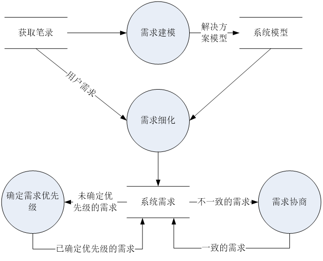

#### 需求细化

- 明确用户需求的隐含因素 
- 将从问题域和业务的角度表述的用户需求等价的转化为从软件和技术的角度表述的系统需求 
- 非功能需求也需要从高层次的表述方式转化为一系列更加详细和具体的需求表述 
- 需求细化也会发现新的细节需求
- 需求已经得了充分的理解，并且开发者已经可以着手为其进行方案设计时停止细化过程 
- 细化后的需求应该被一一的标识和记录下来 

需求的记录

- 标识符（ID），每一条需求都应该能够通过ID唯一的标识自己。
- 源头（Source），要能够回溯到需求的源头，例如特定的涉众。
- 理由（Rational），需求被提出的目的。
- 优先级（Priority），详细情况见下一节。
- 成本（Cost），预估的实现成本。
- 风险（Risk），实现该需求的过程中可能带来的风险。
- 可变性（Volatility），将来发生变化的可能性。

#### 确定需求优先级

累计投票 
区域划分 
重要性。需求的不可或缺程度。
紧急性。需求的时间紧迫程度。
惩罚性。忽略需求会导致的惩罚程度。
成本。实现需求的代价。
风险。需求实现中可能产生的风险程度。 

#### 需求协商

明确冲突的因素，避免情绪上的冲突 
明确冲突的解决空间 
确定最佳解决方案 

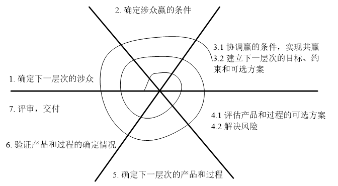

## 3. 需求规格说明

作用：更好的传递软件系统的需求信息和解决方案给所有的开发者

模版的选择与裁剪：优秀的文档：结构组织-复用：模版-选择与裁剪。文字写作：字词、句法-写作技巧

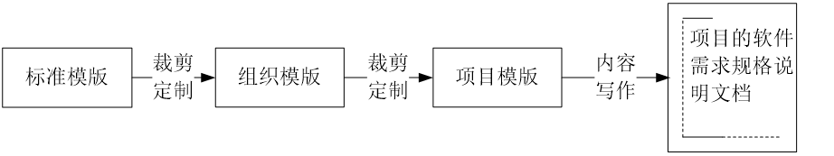

文档写作技巧：

- 原则：简洁、易读  &  严格、准确
- 结构组织：
  - 所有内容位置得当：借鉴和使用标准的文档模版
  - 引用或强化，但不重复：引用而不是复制；强化与重复；引言与冗余元文本

- 表达方式：
  - 形式依赖于内容：根据需要表达的内容，选择合适的表达方式
  - 使用系统的表达方式：人们倾向于系统的表达方式
    - 使用相同的语句格式来描述所有的细节需求。
    - 使用列表或者表格来组织独立、并列的信息。
    - 使用编号来表达繁杂信息之间的关系，包括顺序关系、嵌套关系和层次关系
- 细节描述：
  - 定义术语表或数据字典：术语不一致；“方言”问题；错误术语和冗余术语
  - 避免干扰文本：“这一段的意思是…”；“上一句话是指…”；“众所周知…到底是因为什么呢？”
  - 避免歧义词汇

优秀需求规格说明文档的特性：

- 完备性：描述了用户的所有有意义的需求，包括功能、性能、约束、质量属性和对外接口。定义了软件对所有情况的所有实际输入（无论有效输入还是无效输入）的响应。为文档中的所有插图、图、表和术语、度量单位的定义提供了完整的引用和标记。
  前景和范围、TBD问题
- 一致性：细节的需求不能同高层次的需求相冲突，例如系统需求不能和业务需求、用户需求互相矛盾同一层次的不同需求之间也不能互相冲突
  评审、自动化检查
- 根据重要性和稳定性分级：建立需求的优先级
- 可修改：它的结构和风格使得人们可以对其中任一需求进行容易地、完整地、一致地修改，同时还不会影响文档现有的结构和风格
  - 文档的可修改性要求：
    - 有着条理分明并且易于使用的组织方式，包括目录、索引和显式的交叉引用。
    - 没有重复冗余。
    - 独立表达每个需求，而不是和其他需求混在一起。
- 可跟踪
  - 前向跟踪（Pre-traceability）：能找到需求的来源，例如和更早期文档的显式关联。
  - 后向跟踪（Post-traceability）：能找到需求所对应的设计单元、实现源代码和测试用例等，它要求每个需求都要有唯一的标识或者可供引用的名称

## 4. 需求验证与管理（10 分）

### 需求验证基本活动

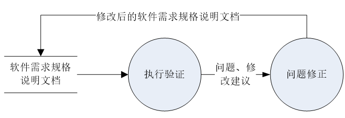

**评审**：由作者之外的其他人来检查产品问题的方法。是主要的静态分析手段。原则上，每一条需求都应该进行评审

- 过程：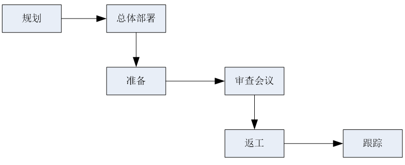

- 检查方法
  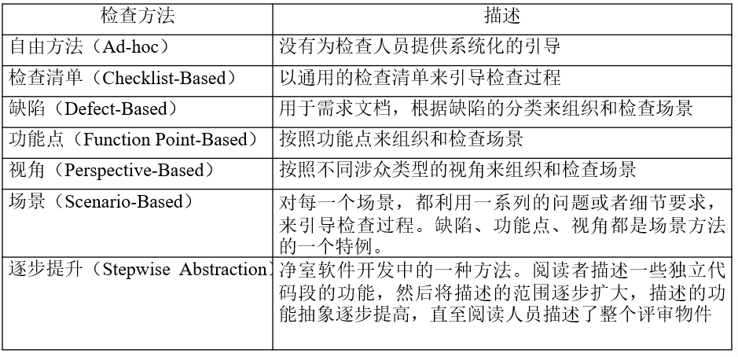

- 类型
  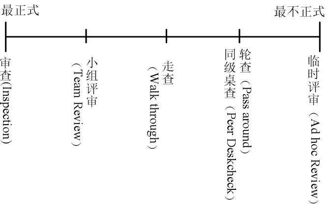

**开发测试用例**：如果无法为某条需求定义完备的测试用例，那么它可能就存在着模糊、信息遗漏、不正确等缺陷
例外：
排斥性需求：这种需求要求特定的行为绝对不会发生，例如需求可能会要求系统故障不能导致数据库的崩溃
全局性非功能性需求：例如可靠性、可用性等，对这些需求的测试往往都是大数据集的处理

- 开发系统测试用例
  （1）以需求为线索，开发测试用例套件；
  （2）使用测试技术确定输入/输出数据，开发测试用例
  基于用例描述，可以为销售处理确定测试用例套件
- 建立测试用数据：主要是基于规格的技术，设计测试场景的输入与输出数据

**用户手册编制**：

- 验证功能需求：对软件系统功能和实现的描述
- 验证项目范围：对系统没有实现的功能的描述
- 验证异常流程需求：问题和故障的解决
- 验证环境与约束需求：系统的安装和启动

**利用跟踪关系**：利用完整的需求工程流程

- 业务需求→用户需求→系统需求：如果业务需求和用户需求没有得到后项需求（用户需求和系统需求）的充分支持，那么软件需求规格说明文档就存在不完备的缺陷。
- 系统需求→用户需求→业务需求：如果不能依据跟踪关系找到一条系统需求的前项用户需求和前项业务需求，那么该需求就属于非必要的需求。

**自动化分析** – 用大模型生成测试断言

**问题修正**：

- 需求澄清（Requirements Clarification）
  - 理解偏差：重新进行分析工作
  - 分析遗漏：重新分析和文档化这部分信息
  - 表达不当：重新以合适的方式表达
- 缺失需求：重新执行需求获取等一系列工作
- 需求冲突：协商解决
- 不切实际的期望：项目调整与需求协商

### 需求管理任务与活动

交流涉众需要什么；
将需求应用、实施到解决方案；
驱动设计和实现工作；
控制变更；
将需求分配到子系统；
测试和验证最终产品；
控制迭代式开发中的变化；
辅助项目管理

### 需求变更控制过程与组织、需求变更注意事项

变更控制过程：以可控、一致的方式进行需求基线中需求的变更处理，包括对变化的评估、协调、批准或拒绝、实现和验证

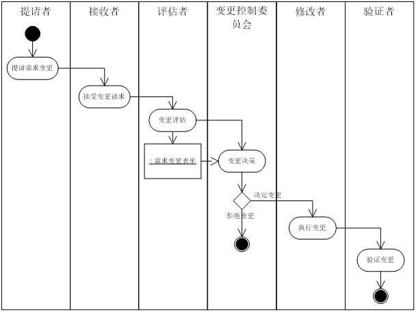

变更控制委员会（CCB）：评价需求的变更，做出批准或者拒绝变化的决定，并确保已批准变化的实现

变更控制委员会可能由来自下列部门的人员组成：项目或程序管理部门；产品管理或者需求分析部门；开发部门；测试或者质量保障部门；市场或客户代表；编写用户文档的部门；技术支持或帮助部门；配置管理部门。

注意事项：

- 认识到变更的必要性，并为之制定计划
  - 定义明确的变更控制过程，建立变更控制的有效渠道
  - 所有提交的需求变更请求都要进行仔细的评估
  - 是否进行变更的决定应该由变更控制委员会统一做出
  - 必须对变更的实现结果进行验证
  - 需求的变化情况要及时的通知到所有会受到影响的项目涉众

- 维护需求基线，审计变更记录
- 管理范围蔓延：根据业务目标、产品前景和项目范围，评估每一项提议的新增需求和特性
- 灵活应对变更请求
  - 推迟产品的交付时间。
  - 要求增派人手：在有限的情况下有效
  - 要求员工加班工作：只能适度的使用。
  - 推迟或者去除尚未实现的优先级较低的需求
  - 容许产品质量的降低：尽量不使用

- 使用辅助工具：工具应该具有以下几个特性，以支持需求变更过程：

  - 可用定义变更请求中的数据项。

  - 可用辅助项目涉众完成变更控制过程中的协作。

  - 可以帮助维护需求基线，审计变更记录。

  - 能够将变更情况及时的通知到相关人员。

  - 可以生成标准的和定制的报告和图表。

    最常用的工具依然是Excel，IBM的Rational Rose提供不带自动化分析的追踪分析工具